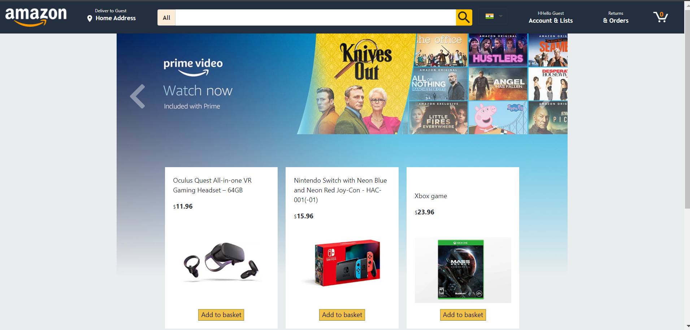
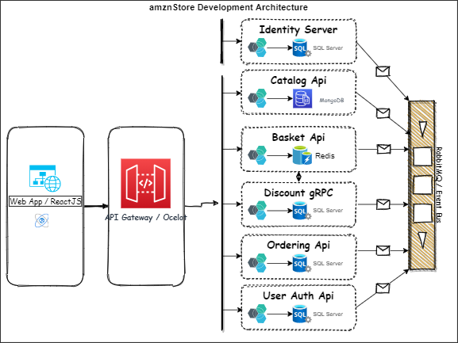

# amznStore

Build Amazon Clone e-commerce website using ASP.NET core and ReactJS based on Microservice Architecture.
Other tool stack include Docker, RabbitMQ, Ocelot API Gateway, Atlas MongoDB, Redis, MS SQL Server.

The application provides feature like: \
Online Shopping \
Discount Implementation \
Dark Mode Theme for the Site \
User Authentication \

**Frontend application built using ReactJS**
State Management using Redux, Thunk, Saga, Reselect, Hooks \
Local Storage using Persist \
API Calls using Axios \
Logging using Logger

## Architecture

The overall project is based on microservice architecture. APIs build based on Onion Architecture\
Authentication using IdentityServer4

All your files and folders are presented as a tree in the file explorer. You can switch from one to another by clicking a file in the tree.

the specification document provides detail information the set-up and packages to installed,
